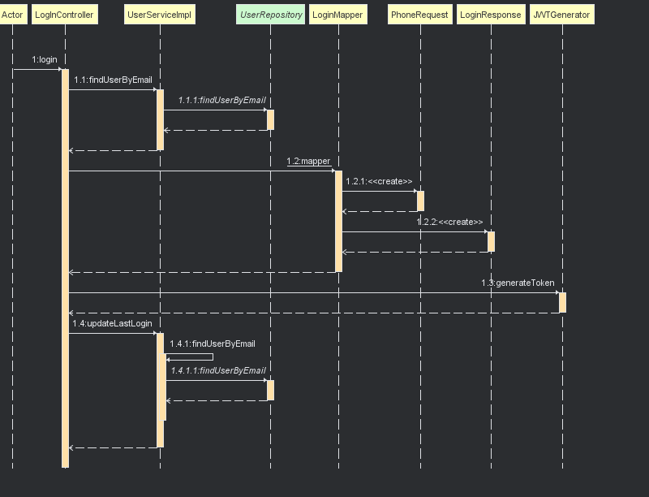

# Getting Started

### Diagrama de secuencia Login

### Diagrama de secuencia Register

### Build and excute
Para ejecutar y construir el jar utilice 

./gradle build  si es linux

gradle.bat build si es windows

El archivos JAR se va encontrar en el directorio "builds/libs"

para ejecutar el archivo usar el siguiente comando
java -jar build/libs/nombre-del-proyecto.jar

